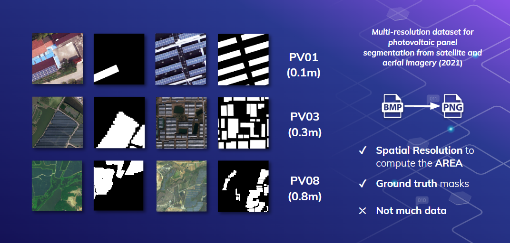

# Labeling Guideline

## Single Panel (aka small, LOD1)

A "single panel" is an isolated panel, mostly small consumer panel, with e.g. no gaps. Abstractly something like figure 1 and the following examples.

```text
+---------------+
|               |
|               |
+---------------+
```
Figure 1

## Array Panel (main label, aka larger, LOD2)

A array of panels are a row of panel with little space or not space between them. Litte space is approx. that no other panel fits in. Abstractly something like figure 2 and the following examples. Most panels should be (sub)-divided to match this shape. Attention: Try to label all like this.

```text
+---------------++---------------++---------------+
|               ||               ||               |
|               ||               ||               |
+---------------++---------------++---------------+
```
Figure 2

## Complex panel (aka very large, surfacy, LOD3)

A "complex panel" is a complex arrangement of panels with no or little space between the panels. Litte space is approx. that no other panel fits in. These are commonly large system 
that make sense to be represented as one unit. If panel can not be represented as array panel, since it very connected or is just one unit, to this.

```text
+---------------++---------------++---------------+
|               ||               ||               |
|               ||               ||               |
+---------------++---------------++---------------+
                                  +---------------+
								  |               |
								  |               |
								  +---------------+
+---------------++---------------++---------------+
|               ||               ||               |
|               ||               ||               |
+---------------++---------------++---------------+
```  


## Labeling inspiration



## Links

- https://github.com/saizk/Deep-Learning-for-Solar-Panel-Recognition/blob/main/reports/figures/sp_dataset.png